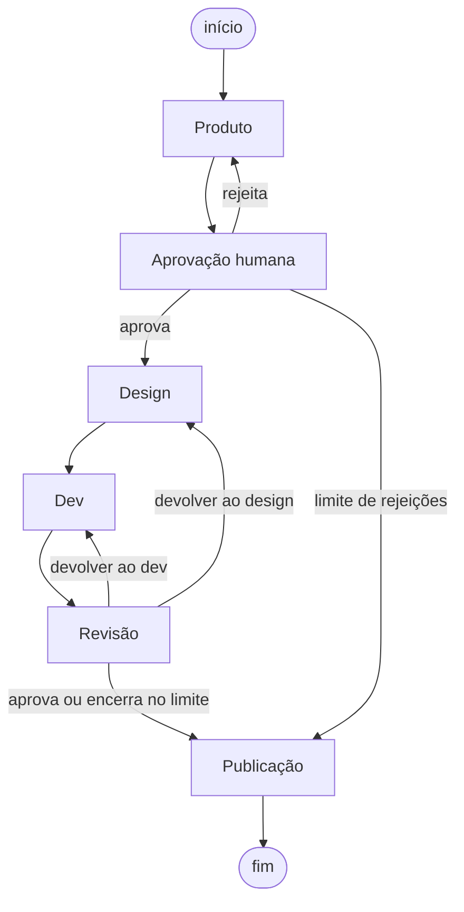
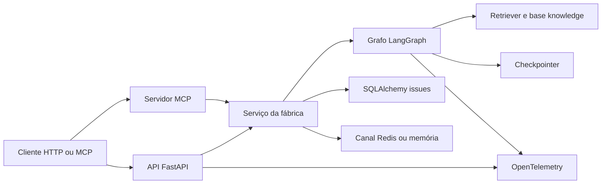

# Fábrica agêntica com LangGraph

[](https://github.com/eribeirossantos/fabrica-agentica-langgraph/actions/workflows/ci.yml)

Um pedido entra. Uma issue priorizada e especificada sai.

Este repositório reproduz, em Python, o fluxo de entrada de uma fábrica de software com agentes: triagem de produto, aprovação humana, especificação de design, plano de desenvolvimento e revisão. O domínio dos exemplos é um aplicativo web genérico de doações. Não há cliente, empresa ou produto real no fluxo.

Eduardo Ribeiro é desenvolvedor brasileiro, com cerca de nove anos em plataforma low-code, passagem por tech lead e base em sistemas legados (COBOL e mainframe). Ele já orquestra esse tipo de fábrica numa plataforma de agentes sem código. Aqui o mesmo desenho está explícito em [LangGraph](https://langchain-ai.github.io/langgraph/), no formato que processos seletivos pedem quando citam LangChain e LangGraph.

## O que cada etapa faz

| Etapa | Papel |
| --- | --- |
| Pedido | Chega com prefixo `bug:`, `melhoria:` ou `dúvida:`. |
| Produto | Resume, corta no menor incremento seguro e monta a issue: título, problema, resultado esperado, fora de escopo, riscos, critérios de aceite, labels e prioridade. |
| Product owner | Aprova ou rejeita. Rejeição com feedback volta para Produto. |
| Design | Escreve UI, copy em pt-BR, perímetro do que não pode ser mexido e requisitos WCAG 2.1 AA. Cita o guia de copy e o checklist. |
| Dev | Escreve plano de implementação, testes e evidências do PR. Não edita código. |
| Revisão | Confere critérios de aceite e perímetro. Pode devolver para Design ou Dev, com limite de voltas. Cita o padrão de critérios. |
| Publicação | Grava a issue em Markdown e JSON, com o registro de cada transição. |

A prioridade segue esta ordem, e a primeira que se aplica ganha:

1. não perder transação ou doação
2. não vazar dado
3. acessibilidade
4. clareza para o usuário
5. cosmético

Tipo, área e prioridade são regras em `src/fabrica/policy.py`, não opinião do modelo. O modelo escreve a narrativa. A revisão também é checklist (`src/fabrica/review_checks.py`): um pacote incompleto não passa só porque o texto soa bem.

## Arquitetura

O estado é um `TypedDict`. O registro de status acumula com um redutor, como um canal que não apaga a mensagem anterior. Cada agente devolve um modelo Pydantic via `ChatPromptTemplate` e `with_structured_output`. A aprovação humana é um `interrupt` do LangGraph: o processo pausa, espera a decisão e retoma o mesmo fio (`thread_id`). Design e revisão consultam a base em `knowledge/` e gravam a citação na issue.



O diagrama acima é a saída de `python -m fabrica --diagrama`, gerada das arestas do grafo compilado. A cópia versionada está em [`docs/grafo.mmd`](docs/grafo.mmd). As decisões de desenho estão em [`docs/ARQUITETURA.md`](docs/ARQUITETURA.md). Um roteiro de quatro semanas para quem já orquestra agentes e quer estudar LangChain e LangGraph está em [`docs/ROTEIRO_DE_ESTUDO.md`](docs/ROTEIRO_DE_ESTUDO.md).

A plataforma em volta do grafo fica assim:



## Como rodar

Requer Python 3.11 ou superior. O padrão é offline: nenhum provedor é chamado e nenhuma chave é necessária.

```bash
python -m venv .venv
source .venv/bin/activate
pip install -e ".[dev]"

python -m fabrica --auto-approve "bug: botão de pagar não responde no celular"
make test
make lint
make evals
```

`make evals` (ou `python -m fabrica evals`) mede acerto de classificação, acerto de prioridade, presença de critérios de aceite e respeito ao perímetro. O dataset está em `src/fabrica/evals/dataset.json`.

### API

```bash
make run-api
```

Isso sobe `http://127.0.0.1:8000` com SQLite local, checkpointer em memória e a base vetorial em memória. A documentação interativa fica em `/docs`.

```bash
curl -s http://127.0.0.1:8000/health

curl -s -X POST http://127.0.0.1:8000/pedidos \
  -H 'content-type: application/json' \
  -d '{"pedido":"bug: botão de pagar não responde no celular"}'

curl -s -X POST http://127.0.0.1:8000/pedidos/$ID/decisao \
  -H 'content-type: application/json' \
  -d '{"decision":"approve"}'

curl -s http://127.0.0.1:8000/pedidos/$ID
curl -s http://127.0.0.1:8000/pedidos/$ID/issue
curl -s http://127.0.0.1:8000/pedidos/$ID/issue.md
```

`POST /pedidos` inicia o grafo e para em `aguardando_aprovacao`. `decision` aceita `approve` ou `reject`. Rejeição leva `feedback` e devolve o texto ao produto. A issue final só existe depois da publicação: antes disso a rota responde 409.

### MCP

O servidor expõe `criar_issue`, `consultar_status` e `buscar_conhecimento` no stdio:

```bash
make run-mcp
```

Num cliente MCP, o servidor local é o comando `python -m fabrica.mcp_server`. Em JSON de configuração de cliente, a entrada fica assim:

```json
{
  "mcpServers": {
    "fabrica": {
      "command": "python",
      "args": ["-m", "fabrica.mcp_server"]
    }
  }
}
```

Um agente LangChain carrega essas tools com `langchain-mcp-adapters`. O código está em `src/fabrica/mcp_client.py`: `MultiServerMCPClient` com transporte `stdio` e `await client.get_tools()`.

### Docker Compose

O compose sobe a API, o Postgres com pgvector e o Redis. O processo continua offline, com embeddings determinísticos. Jaeger e o coletor OpenTelemetry entram só no perfil `observability`.

```bash
docker compose up --build
curl -s http://127.0.0.1:8000/health
```

Com rastreio OTLP:

```bash
docker compose --profile observability up --build
```

Nesse perfil, defina `OTEL_TRACES_EXPORTER=otlp` e `OTEL_EXPORTER_OTLP_ENDPOINT=http://otel-collector:4318` no serviço `api`. A interface do Jaeger fica em `http://127.0.0.1:16686`.

### Modelo com chave

```bash
pip install -e ".[dev,llm]"
cp .env.example .env
```

No `.env`, escolha `LLM_PROVIDER` (`openai`, `azure`, `anthropic` ou `google`), preencha só a chave daquele provedor, defina `FABRICA_OFFLINE=0` e, se quiser, `LLM_MODEL`. Para o Azure também entram `AZURE_OPENAI_ENDPOINT`, `AZURE_OPENAI_API_VERSION` e `AZURE_OPENAI_DEPLOYMENT`. Cada agente pode usar outro provedor com `PRODUCT_LLM_PROVIDER`, `DESIGN_LLM_PROVIDER`, `DEV_LLM_PROVIDER` e `REVIEW_LLM_PROVIDER`. O arquivo `.env` está no `.gitignore`.

```bash
python -m fabrica --online --auto-approve "bug: botão de pagar não responde no celular"
```

Postgres, Redis, pgvector e o exportador OTLP estão no extra `infra` (`pip install -e ".[infra]"`). O compose já instala esse extra na imagem. Testes que precisam desses serviços levam a marca `integration` e ficam de fora do `pytest` padrão.

Traces: `OTEL_TRACES_EXPORTER` aceita `none` (padrão dos testes), `console` ou `otlp`. Logs em JSON: `FABRICA_LOG_FORMAT=json`. LangSmith continua opcional, com `LANGSMITH_TRACING`, `LANGSMITH_API_KEY` e `LANGSMITH_PROJECT`.

Sem `--auto-approve`, o processo mostra a issue e pergunta `s` ou `n`. Um `n` pede feedback e devolve o texto ao agente de produto. Três rejeições cancelam. Três devoluções da revisão encerram o pacote com as pendências escritas.

```bash
python -m fabrica "dúvida: o que acontece com a doação se o pagamento falhar?"
python -m fabrica --auto-approve --saida /tmp/issue "melhoria: aumentar o contraste do texto de confirmação da doação"
```

Testes e lint, os mesmos do CI:

```bash
ruff check .
pytest
```

## Saída de exemplo

Pedido: `bug: botão de pagar não responde no celular`. Modo offline, com aprovação automática. O canal de status fica assim:

```text
[produto] issue especificada — P1 · bug · checkout — Botão de pagar não responde no celular
[product owner] aprovado — Issue aprovada para design.
[design] especificação de design pronta — 4 itens no perímetro.
[dev] plano de implementação pronto — 3 testes planejados.
[revisão] revisão aprovada — Pacote cobre os critérios de aceite e respeita o perímetro.
[fábrica] publicado — Issue publicada em Markdown e JSON.
```

A issue publicada começa assim:

```markdown
# Issue: Botão de pagar não responde no celular

- **Tipo:** bug
- **Área:** checkout
- **Prioridade:** P1 — não perder transação ou doação
- **Labels:** `tipo:bug` `área:checkout` `prioridade:P1`
```

Os três pedidos e as saídas completas estão em [`examples/`](examples/). Foram gerados pelo modo offline.

| Pedido | Tipo | Prioridade |
| --- | --- | --- |
| [`01-bug-pagar`](examples/pedidos/01-bug-pagar.txt) | bug | P1 — não perder transação ou doação |
| [`02-melhoria-contraste`](examples/pedidos/02-melhoria-contraste.txt) | melhoria | P3 — acessibilidade |
| [`03-duvida-pagamento`](examples/pedidos/03-duvida-pagamento.txt) | dúvida | P4 — clareza para o usuário |

## Decisões que importam numa entrevista

- **Grafo explícito, não um supervisor livre.** A ordem produto → aprovação → design → dev → revisão é o processo. O modelo não escolhe o próximo agente. Quem escolhe é a aresta condicional.
- **Política fora do prompt.** Classificação e prioridade erradas custam caro. Ficam em código testável. O prompt só pede a narrativa coerente com essa decisão.
- **Interrupt de verdade.** A aprovação não é um `input()` escondido no meio de uma função solta. É um nó que pausa o grafo. Retomar reexecuta o nó; por isso não há efeito colateral antes do `interrupt`.
- **Modo offline no caminho padrão.** Recrutador e CI rodam o fluxo inteiro sem chave. O stub preenche os mesmos schemas Pydantic do chat model.
- **Revisão com teto.** Devolver para Design ou Dev é permitido. Na terceira volta sem aprovação, o pacote é publicado com as pendências, em vez de girar para sempre.
- **RAG cita, a política decide.** O retriever alimenta design e revisão. Tipo e prioridade continuam em `policy.py`. A citação vai no campo `fontes`, escrita pelo nó, não pelo modelo.

## Próximos passos

O que este repositório ainda não faz, e o que eu estudaria em seguida para uma plataforma de agentes em produção:

- **Kubernetes e Helm.** Empacotar a API, o Postgres e o Redis num chart, com probe no `/health`, segredo fora da imagem e um checkpointer que sobrevive ao restart do pod.
- **CrewAI ou AutoGen.** Comparar este grafo fixo com um framework em que os agentes conversam entre si. O processo da fábrica cabe melhor numa aresta explícita; o outro estilo passa a valer quando o conjunto de especialistas muda a cada pedido.
- **Arquitetura orientada a eventos.** O canal Redis já publica o status. O passo seguinte é um consumidor separado para notificação, avaliação e auditoria, sem o request HTTP esperar o grafo inteiro quando o pedido puder ser assíncrono.

O roteiro de estudo detalha o que já está no código, semana a semana.

## Licença

[MIT](LICENSE). Copyright (c) 2026 Eduardo Ribeiro.
